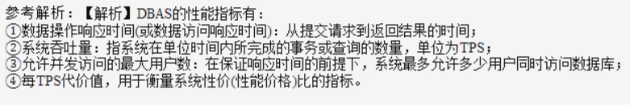
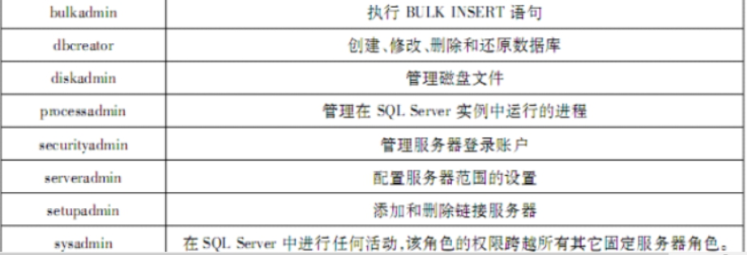

# 全国计算机三级数据库笔记

## 第一章 数据库结构设计

1. `数据库三级模式`

   > 1. 外模式(子模式用户模式)：是数据库用户的视图
   > 2. 模式(逻辑模式)：全体数据的==逻辑结构==用户不可见，是三级模式的中间部分
   > 3. 内模式(存储模式物理模式)：对应数据库的==物理结构==和==存储方式==
   >
   > ==外模式/模式==保证了数据与程序的==逻辑独立性==
   >
   > ==模式/内模式==保证了==物理独立性==

2. `关系模型`

   > 
   >
   > ==关系模式==描述关系的==静态结构==，而==关系==是==动态==的

3. ==数据字典==是对系统中各类数据描述的集合

4. `概念数据模型`

   

5. ==查询处理器==会为编译好的查询语句生成执行计划,并根据执行计划访问相关数据

6. `实施活动`

   > 包括创建数据库、装载数据、应用程序的编码和调试以及数据库的试运行

   1,2是实施活动，3,4,5是运行和维护活动

   

7. `视图`

   

   

8. `数据库应用系统设计`

   > 1. 采用自上而下的ER设计
   > 2. 逻辑设计阶段：设计视图和关系模式的完整性约束
   > 3. 物理设计阶段：将关系模式转换为具体DBMS平台支持的关系表

9. 完成数据库关系模式设计的阶段是==逻辑设计==

10. DBAS生命周期模型中时间最长的是==运行管理与维护==

11. `数据仓库`

    > 不做==日常查询==，也不是==汇总和统计==，主要用于提取数据中的潜在信息和指示

12. ==OLAP==是联系分析处理的英文缩写，==仍使用DBMS存取数据==

13. ==概念模型设计==，为每一个实体集的==实体==命名，而不是==实例==

14. `DBMS设计`

    `规划与分析`

    > - 经济：成本等
    > - 技术：
    > - 操作：是否有==人员资源==
    > - 开发方案

    `需求与分析`

    > - 数据：对数据进行组织存储，从用户视图出发，数据字典
    >
    > - 功能：应当做什么
    >
    > - 性能：应当做到什么程度
    >
    > - 其他
    >
    >   > - 存储
    >   > - 安全性
    >   > - 备份和恢复

    `系统设计`

    > `概念设计阶段`
    >
    > > 1. 数据库概念模型设计
    > >
    > > 2. 系统总体设计
    > >
    > >    相关活动
    > >
    > >    > - 设计ER图
    >
    > `逻辑设计阶段`
    >
    > 主要工作将现实世界概念数据模型设计成数据库的一种逻辑模式
    >
    > > 1. 逻辑结构设计
    > >
    > > 2. 应用程序概要设计
    > >
    > > 3. 数据库事务概要设计
    > >
    > >    相关活动
    > >
    > >    > - 将ER图转换为关系模式
    > >    > - 定义约束
    >
    > `物理设计阶段`
    >
    > > 1. 物理结构设计
    > >
    > > 2. 应用程序==详细设计==
    > >
    > > 3. 事务==详细设计==
    > >
    > >    相关活动
    > >
    > >    > - 用SQL语句描述活动
    > >    > - 索引设计
    >

    `实现与部署阶段`

    > 1. 建立数据库结构
    > 2. 数据加载
    > 3. 事务和应用程序的编码及测试
    > 4. 系统集成
    > 5. 测试与试运行
    > 6. 系统部署

    `运行管理与维护`

    > 1. 数据库监控与分许
    >
    > 2. 性能优化
    >
    >    > 1. 数据运行环境：用RAID1代替满足密集写作
    >    >
    >    > 2. 数据库参数调整
    >    >
    >    > 3. 模式调整
    >    >
    >    > 4. 存储查询优化
    >    >
    >    >    ==视图==是设计阶段，不是优化阶段

    

15. `数据库完整性`

    > 1. 实体完整性：主键
    > 2. 参照完整性：外键
    > 3. 用户自定义完整性：not null,unique,check

    ==Grant==是定义数据库安全性，赋予操作权限

16. `DBAS性能指标`

    

17. `系统规划和定义`

    > 1. 任务陈述
    > 2. 确定任务目标
    > 3. 确定系统范围和边界
    > 4. 确定用户视图

18. ER图转关系模式，一对多时并入到多端，不用转为关系模式

19. `事务规范`

    > 表达==数据处理需求==

    `内容`

    > - 名称
    > - 描述
    > - 所访问的数据项
    > - 用户

20. `日常维护`

    > - 备份与恢复
    > - 完整性维护
    > - 安全性维护
    > - 存储空间管理
    > - 并发控制

21. `系统规划与定义`

    > - 任务陈述
    > - 确定任务目标
    > - 确定系统范围和边界
    > - 确定用户视图

22. 一个属性的值必须取自==唯一的域==

23. `复制数据库的方法`

    > 1. 使用==复制数据库向导==在服务器之间复制或移动数据库。
    > 2. 还原数据库备份,若要复制整个数据库,可以使用 BACKUP和 RESTORE Transact-SQ语句。通常,还原数据库的完整备份用于因各种原因将数据库从一台计算机复制到其他计算机

24. `用户定义的完整性`

    > ==可以用 CHECK短语指定列值应满足的条件,也可以用触发器约束==,通过服务器自动激活相应的触发器,对数据进行完整性控制。所以触发器或 CHECK约束都可以实现。==但 DEFAULT约束不能实现用户自定义的完整性==,只能表示实体或参照完整性

25. 当用户被赋予的两种角色的权限出现冲突时,为了安全起见,都是==DENY==优先，==DENY==指拒绝操作

26. 对 master、 model、msdb实行==修改之后即备份==,对用户数据库实行==周期性备份==,对 tempdb(临时缓存)==不备份==

27. `并行数据库划分方式`

    > - 轮转法：对关系顺序扫描，保证了元组在多个磁盘上均匀分布
    > - 散列划分：基于划分属性进行散列
    > - 范围划分：按照关系中某个属性的取值范围将数据文件划分为几部分

28. `数据仓库`

    > 面向主题的，集成的，非易失的，随时间不断变化

    > - 不可更新性(不实时同步更新)
    > - 随时间变化性

    粒度

    > 粒度问题是设计数据仓库的个最重要方面。==粒度是指数据仓库的数据单位中保存数据的细化或综合程度的级别==。
    >
    > - 细化程度越==髙==,粒度级就越==小==
    > - 细化程度越==低==,粒度级就越==大==

29. `数据模型三要素`

    > - 数据结构：所研究对象的集合，==描述了客观世界本身对象和数据之间的联系==，是对系统静态描述
    > - 数据操作：主要指检索和更新，对系统动态的描述
    > - 完整性约束：完整性规则的集合，规定数据库状态和满足条件

30. `前三项且并列`

    ```sql
    TOP 3 WITH TIES
    ```

31. `UML图`

    ### 活动图

    <div align=center></div>
### 用例图

> 用例，系统，角色

<div align=center></div>
### 类图

> 属性，操作，关系

>
>连接
>
>> - 泛化：空心三角实线，指向==父类==
>> - 实现：空心三角虚线，指向==接口==
>> - 关联：普通箭头实心线，指向被==拥有者==
>> - 依赖：普通箭头的虚线，指向被==使用者==
>> - 聚合：空心菱形实线，指向==整体==
>> - 合成：实心菱形实线，指向==整体==

<div align=center></div>
​    
### 顺序图

### 通信图

32. `赋予权限`

    

33. 数据库管理系统一般通过周期性检查==事务等待图==来实现死锁检测

34. 事务并发修改数据破坏了数据==隔离性==

35. `数据库系统故障后恢复`

    > - 故障发生前已经提交的事务(有BEGIN,COMMIT记录)：执行==REDO==操作
    > - 故障发生时尚未完成的事务(只有BEGIN，没有COMMIT或ROLLBACK)：执行==UNDO==

36. `并行数据库`

    > - 完全共享资源结构：共享硬件，数据存取要通过公共路线
    > - 完全不共享资源结构：由多个小系统代替

37. `ER图转实体关系`

    > - 一对多时：在多的那一方加入一的主码
    > - 多对多：==新创建==一个关系模式，由两个实体主码构成和联系的属性
    
38. ==函数依赖==研究关系中属性之间的依赖关系

39. `数据库并发控制锁`

    > 锁：特殊的二元信号量，用来控制并发事务对共享资源的使用

    > - 排它锁：当事务T加上后，可以对数据进行==读和写==，其他任何事务不能再加==任何锁==
    > - 共享锁：事务T加上后，可以对数据进行==读==，其他事务只能加==共享锁==，只有等到该数据没有被任何事务访问才能加==排它锁==

40. 动态转储：利用==转储文件==和==日志文件==综合使用才能使数据库恢复到一致状态

41. ==CHECK==约束

    > - 只有一列时：放在列后面
    > - 有多列时要放在最后面

42. `数据管理与数据分析形式`

    > - OLTP：微观操作，==面向中上层和决策者使用==，通常对==一条记录==操作，要求快速响应，对数据安全性等==要求很高==
    >
    > - OLAP：宏观操作，通常对海量数据操作，查询操作非常复杂，==多维分析操作==如下
    >
    >   > - 切片：局部数据显示
    >   > - 切块：局部数据显示
    >   > - 旋转：改变维方向
    >   > - 钻取：下降维或引入维
    >   > - 卷起：数据立方体执行聚集操作，通过上升或消除维

43. `整型类型`

    > - tinyint：0-255
    > - smallint：-2^15^~2^15^-1
    > - int：-2^31^~2^31^-1
    > - bigint：-2^63^~2^63^-1

44. `划分方式`

    > - 轮转划分：对关系顺序扫描，将第i个元组存储到标号为Dimod磁盘上，保证了在==磁盘均匀分布==
    > - 散列划分：选定一个函数，对关系中元组基于==划分属性==散列，如果散列函数返回i，则将其存储到第i个磁盘
    > - 范围划分：根据表中==某个属性取值区间==划分成不同的子区间
    > - 多维划分：用人们逻辑认知从维度来划分

45. COUNT(==DISTINCT== 列名)，用来消除指定列重复值

46. `创建视图，索引，存储过程，触发器，游标`

    视图

    ```sql
    /*通常不包含ORDER BY和DISTINCT*/
    CREATE VIEW 视图名(列名)
    AS
    SELECT...
    [WITH CHECK OPTION]/*用来操作时满足视图定义的谓词条件*/
    ```

    索引
    >- 类型
    >
    >
    >  > - 聚集索引：是指索引项的顺序与表中记录的物理顺序一致的索引组织。
    >  >- 非聚集索引
    
    ```sql
    CREATE [UNIQUE唯一][CLUSTERED聚集][NONCLUSTERED] INDEX 索引名
    ON 表名(列名)
    ```
    
    存储过程
    
    ```sql
    CREATE PROCEDURE 存储名 @输入参数 类型,@输出参数 类型 OUTPUT
    AS
    DECLARE
    @参数名1 类型
        BEGIN
        IF ... THEN
    ...
        END IF
        ...
     END
     /*执行*/
     EXEC 存储名 参数值，参数 output
    ```
    
     触发器
    
    > 不能再==视图==上定义==FOR/AFTER==，after可以在同一个操作建立多个触发器，instead of只能在同一个操作建一个 
    
    ```sql
     CREATE TRIGGER 触发器名
        ON 表名/视图名
        [FOR][INSTEAD OF] [INSERT][UPDATE][DELETE]
        AS
        	DECLARE @变量名 类型
        	[FROM INSERTED/DELETED]
        ...
        END
    ```
    
      
    
     游标
    
    > 1
    
    ```sql
    DECLARE 游标名 cursor
    for select...
    ```
    
    
    
    函数
    
    > 
    
    ```sql
    CREATE FUNCTION 函数名(@参数名)
    RETURNS 类型或@表名(列名)
    AS
    BEGIN
    	...
    	[INSERT INTO @表名]
    	RETURN
    END
    ```
    
    


​    

47. `关系模式分解`

    > - 无损连接：分解后重组时不会丢失记录
    > - 函数依赖：根据依赖集判断

48. 数据库设计没有说索引和日志放在高速低速磁盘，要按==访问频率来看==

49. 三层架构将更多的任务传给服务器端计算,所以增加了网络的通信量,其运行速度受制于网络,并不一定会提高。==在适用Internet、维护工作==等等方面,B/S比C/S强;==在运行速度、数据安全、人机交互==等方面,不如C/S

50. ==RAD10==比==RAID5==在写数据上更稳定、速度更快,所以C项中应尽量避免存储在RAID5的磁盘存储系统中。

51. ==SQL Server Agent==是一个任务规划器和警报管理器

52. 用户仅仅能登录到实例，则只能对==master、msdb==数据库部分数据进行查询

53. 增加冗余列可以减少==JOIN==操作而不是==UNION==操作

54. `分布式数据库分配方式`

    > - 集中式：所有数据片段在一个场地
    > - 分割式：全局数据只有一份，被分割成若干段
    > - 复制式：在每个站点上，都有全局复制的复制样本，==数据的冗余性最大==
    > - 混合式：部分站点上是全局数据的若干片段，部分站点是全局数据的副本

55. `分布透明性`

    > - 分片透明性：==最高层次==，用户或应用程序只对全局关系进行操作而不必考虑关系分片情况
    > - 位置透明性：==第二层次==，只需了解数据分片情况，而不必了解片段的存储场地
    > - 局部数据模型透明性：不必了解局部场地上使用的是那种数据模型，但是必须了解全局数据的分片情况，还需了解副本复制和场地位置情况

56. `关联规则挖掘`

    > - 支持度：
    >   $$
    >   S=(X·Y)/N
    >   $$
    >   (X·Y)为X和Y一起出现次数，N为集合数
    >
    > - 置信度：
    >   $$
    >   S=(X·Y)/X
    >   $$
    >   (X·Y)为X和Y一起出现次数，X为依赖左边出现的次数

    <div align=center></div>

57. 关系数据库中的视图提供了==逻辑数据独立性==

58. `集合操作`

    > - UNION：并集
    > - INTERSECT：交集
    > - EXCEPT：差集

59. ==DATEDIFF( datepart, startdate enddate)==, startdate和 enddate参数是合法的日期表达式。例如SQL表达式:SELECT DATEDIFF(day, 2008-12-30, 2008-12-29)AS DiffDate.==DATAPART==用来提取某个时间的年份月份等

60. images

61. `系统角色`

    <div align=center></div>

62. `故障`

    > - 事务内部故障
    >
    >   > - 预期
    >   > - 非预期：不能由应用程序处理，计算溢出，死锁
    >
    > - 系统故障：造成系统停止运转的任何事件
    >
    > - 介质故障：硬件
    >
    > - 计算机病毒

63. ==两阶段加锁协议==可以保证事务调度的==可串行性==。

64. `转储`

    > - 完全备份
    > - 差量备份
    > - 增量备份

65. 在分布式数据库中,采用==半连接操作==可以减少场地之间的数据传输量，即在网络中只传输参与连接的数据

66. `元数据`

    > 数据仓库中
    >
    > - 技术元数据
    > - 业务元数据

67. `数据流图DFD`

    > 是==系统逻辑模型==重要组成部分
    >
    > 特性
    >
    > > - 抽象性
    > > - 概括性

68. `数据库应用系统四个层次`

    > - 表示层
    > - 业务逻辑层
    > - 数据访问层
    > - 数据持久层：属于数据组织与存储等方面的==物理设计内容==，索引设计属于物理设计阶段
    > 

69. `索引视图`

    > - ==只能==引用同一数据库中的基表，==而不能是其他标准视图==，所引用的函数必须是确定性的，行==集函数，派生表和子查询==都不能再索引视图使用
    >
    > - 在视图上创建一个唯一索引，由视图的完整结果集组成
    >
    > - 数据库将==保存==该视图内容
    >
    >   `适合`
    >
    >   > - 处理大量行的联接和聚合
    >   > - 许多査询经常执行联接和聚合操作
    >   > - 决策攴持工作负荷
    >
    >   `不适合`
    >
    >   > - 具有大量写操作的OLTP系统
    >   > - 具有大量更新的数据库
    >   > - ==不涉及==聚合或联接的查询
    >   > - GROUP BY键具有髙基数庋的数据聚合

70. 数据库添加数据文件

71. guest用户

    <div align=center></div>

72. windows身份验证

    <div align=center></div>

73. `数据库维护`

    > 1. 数据库的==转储和恢复==；
    > 2. 数据库安全性、完整性控制；
    > 3. 数据库性能的检测和改善；
    > 4. 数据库的重组和重构。

74. ==Raid5==需要3块硬盘，并把数据和相对应的奇偶校验信息存储到组成raid5的各个磁盘上。其中任意N-1块磁盘上都存储完整的数据，也就是说有相当于一块磁盘容量的空间用于存储奇偶校验信息。

75. `数据库备份`

    <div align=center></div>

76. `恢复顺序`

    <div align=center></div>

77. XML数据库

    <div align=center></div>

78. 数据库模式定义语言==DDL==（ Data Description Language）是用于描述数据库中要存储的现实世界实体的语言,执行后的结果不能回滚

79. 在 SQL Server2008中，能够出现在 SELECT语句目标列中的用户自定义函数是==标量函数==。

80. 在SQL Server2008中，用户数据库中主要数据文件的扩展名为==MDF==

81. 为避免==活锁现象==的发生，数据库管理系统采用==先来先服务==策略处理事务的加锁请求

82. 在OLAP的实现方式中，以多维数组作为存储结构的被称作==MOLAP==

83. `数据库优化`

    <div align=center></div>

84. 1

85. 1

86. 


# 抢答规则

> 1. 每次抢答开始主持人都会发送emoji表情:heart:来做开头，抢答者==发送弹幕1==，抽第一个来作答并==输入答案到弹幕上==
> 2. 答对为止，答错继续开始抢答
> 3. 在此期间请勿刷表情，谢谢配合


# 抢麦规则

> 1. 主持人宣布开始后，==主持人==选择==麦序模式==，==抢答者==点击==上方麦克风==进入抢麦界面抢麦
> 2. 抢麦第一个成功后，点击下方==开始发言==进行发言，每个人限时==两分钟==，超过则会==提醒==，再超过就会==控麦==以停止你发言
> 3. 每一轮发言结束后，主持人会提醒==所有人==下麦，然后宣布开始新一轮抢麦


````

````