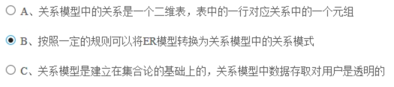
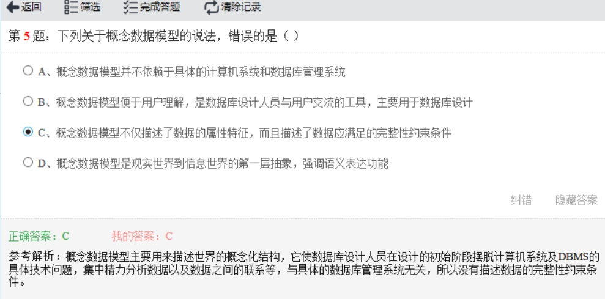
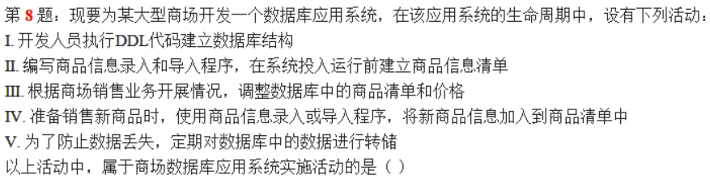
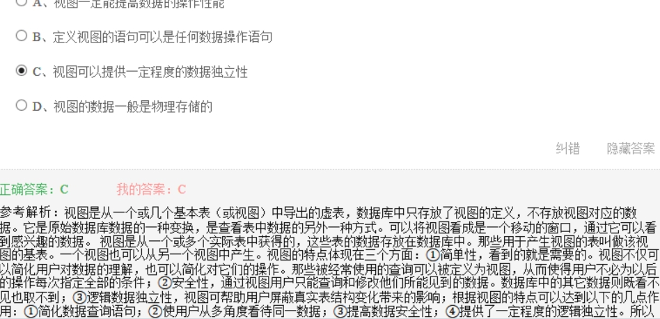

# 全国计算机三级数据库笔记

## 第一章 数据库结构设计

1. `数据库三级模式`

   > 1. 外模式：
   > 2. 模式：全体数据的==逻辑结构==用户不可见，是三级模式的中间部分
   > 3. 内模式：对应数据库的==物理结构==和==存储方式==
   >
   > ==外模式/模式==保证了数据与程序的==逻辑独立性==
   >
   > ==模式/内模式==保证了==物理独立性==

2. `关系模型`

   > 
   >
   > ==关系模式==描述关系的==静态结构==，而==关系==是==动态==的

3. ==数据字典==是对系统中各类数据描述的集合

4. 

   

5. 查询处理器会为编译好的查询语句生成执行计划,并根据执行计划访问相关数据

6. 1,2是实施活动，3,4,5是运行和维护活动

   

7. `视图`

   

   

8. `数据库应用系统设计`

   > 1. 采用自上而下的ER设计
   > 2. 逻辑设计阶段：设计视图和关系模式的完整性约束
   > 3. 物理设计阶段：将关系模式转换为具体DBMS平台支持的关系表

9. 完成数据库关系模式设计的阶段是==逻辑设计==

10. DBAS生命周期模型中时间最长的是==运行管理与维护==

11. `数据仓库`

    > 不做==日常查询==，也不是==汇总和统计==，主要用于提取数据中的潜在信息和指示

12. 

    

    

    

