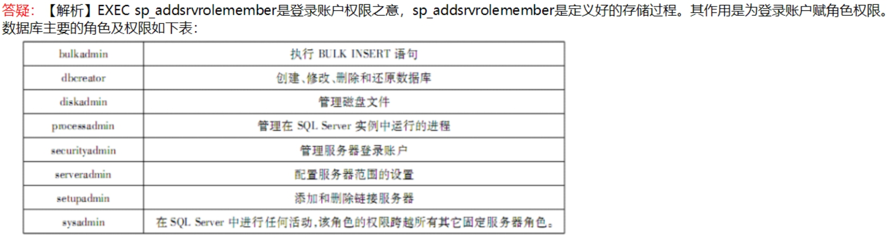

# 全国计算机三级数据库笔记

## 第一章 数据库结构设计

1. `数据库三级模式`

   > 1. 外模式：
   > 2. 模式：全体数据的==逻辑结构==用户不可见，是三级模式的中间部分
   > 3. 内模式：对应数据库的==物理结构==和==存储方式==
   >
   > ==外模式/模式==保证了数据与程序的==逻辑独立性==
   >
   > ==模式/内模式==保证了==物理独立性==

2. `关系模型`

   > 
   >
   > ==关系模式==描述关系的==静态结构==，而==关系==是==动态==的

3. ==数据字典==是对系统中各类数据描述的集合

4. 

   

5. 查询处理器会为编译好的查询语句生成执行计划,并根据执行计划访问相关数据

6. `实施活动`

   > 包括创建数据库、装载数据、应用程序的编码和调试以及数据库的试运行

   1,2是实施活动，3,4,5是运行和维护活动

   

7. `视图`

   

   

8. `数据库应用系统设计`

   > 1. 采用自上而下的ER设计
   > 2. 逻辑设计阶段：设计视图和关系模式的完整性约束
   > 3. 物理设计阶段：将关系模式转换为具体DBMS平台支持的关系表

9. 完成数据库关系模式设计的阶段是==逻辑设计==

10. DBAS生命周期模型中时间最长的是==运行管理与维护==

11. `数据仓库`

    > 不做==日常查询==，也不是==汇总和统计==，主要用于提取数据中的潜在信息和指示

12. ==OLAP==是联系分析处理的英文缩写，==仍使用DBMS存取数据==

13. ==概念模型设计==，为每一个实体集的==实体==命名，而不是==实例==

14. `DBMS设计`

    `规划与分析`

    > - 经济：成本等
    > - 技术：
    > - 操作：是否有==人员资源==
    > - 开发方案

    `需求与分析`

    > - 数据：对数据进行组织存储，从用户视图出发，数据字典
    >
    > - 功能：应当做什么
    >
    > - 性能：应当做到什么程度
    >
    > - 其他
    >
    >   > - 存储
    >   > - 安全性
    >   > - 备份和恢复

    `系统设计`

    > `概念设计阶段`
    >
    > > 1. 数据库概念模型设计
    > > 2. 系统总体设计
    >
    > `逻辑设计阶段`
    >
    > > 1. 逻辑结构设计
    > > 2. 应用程序概要设计
    > > 3. 数据库事务概要设计
    >
    > `物理设计阶段`
    >
    > > 1. 物理结构设计
    > > 2. 应用程序==详细设计==
    > > 3. 事务==详细设计==
    >

    `实现与部署阶段`

    > 1. 建立数据库结构
    > 2. 数据加载
    > 3. 事务和应用程序的编码及测试
    > 4. 系统集成
    > 5. 测试与试运行
    > 6. 系统部署

    `运行管理与维护`

    > 1. 数据库监控与分许
    >
    > 2. 性能优化
    >
    >    > 1. 数据运行环境：用RAID1代替满足密集写作
    >    >
    >    > 2. 数据库参数调整
    >    >
    >    > 3. 模式调整
    >    >
    >    > 4. 存储查询优化
    >    >
    >    >    ==视图==是设计阶段，不是优化阶段

    

15. `数据库完整性`

    > 1. 实体完整性：主键
    > 2. 参照完整性：外键
    > 3. 用户自定义完整性：not null,unique,check

    ==Grant==是定义数据库安全性，赋予操作权限

16. `DBAS性能指标`

    

17. `系统规划和定义`

    > 1. 任务陈述
    > 2. 确定任务目标
    > 3. 确定系统范围和边界
    > 4. 确定用户视图

18. ER图转关系模式，一对多时并入到多端，不用转为关系模式

19. `事务规范`

    > 表达==数据处理需求==

    `内容`

    > - 名称
    > - 描述
    > - 所访问的数据项
    > - 用户

20. `日常维护`

    > - 备份与恢复
    > - 完整性维护
    > - 安全性维护
    > - 存储空间管理
    > - 并发控制

21. `系统规划与定义`

    > - 任务陈述
    > - 确定任务目标
    > - 确定系统范围和边界
    > - 确定用户视图

22. 一个属性的值必须取自==唯一的域==

23. `复制数据库的方法`

    > 1. 使用复制数据库向导在服务器之间复制或移动数据库。
    > 2. 还原数据库备份,若要复制整个数据库,可以使用 BACKUP和 RESTORE Transact-SQ语句。通常,还原数据库的完整备份用于因各种原因将数据库从一台计算机复制到其他计算机

24. `用户定义的完整性`

    > ==可以用 CHECK短语指定列值应满足的条件,也可以用触发器约束==,通过服务器自动激活相应的触发器,对数据进行完整性控制。所以触发器或 CHECK约束都可以实现。==但 DEFAULT约束不能实现用户自定义的完整性==,只能表示实体或参照完整性

25. 当用户被赋予的两种角色的权限出现冲突时,为了安全起见,都是==DENY==优先，==DENY==指拒绝操作

26. 对 master、 model、msdb实行==修改之后即备份==,对用户数据库实行==周期性备份==,对 tempdb(临时缓存)==不备份==

27. `并行数据库划分方式`

    > - 轮转法：对关系顺序扫描，保证了元组在多个磁盘上均匀分布
    > - 散列划分：基于划分属性进行散列
    > - 范围划分：按照关系中某个属性的取值范围将数据文件划分为几部分

28. `数据仓库`

    > 面向主题的，集成的，非易失的，随时间不断变化

    > - 不可更新性(不实时同步更新)
    > - 随时间变化性

    粒度

    > 粒度问题是设计数据仓库的个最重要方面。==粒度是指数据仓库的数据单位中保存数据的细化或综合程度的级别==。
    >
    > - 细化程度越==髙==,粒度级就越==小==
    > - 细化程度越==低==,粒度级就越==大==

29. `数据模型三要素`

    > - 数据结构
    > - 数据操作
    > - 完整性约束‘

30. `前三项且并列`

    ```sql
    TOP 3 WITH TIES
    ```

31. `UML图`

    ### 活动图

    ### 用例图

    ### 类图

    ### 顺序图

    ### 通信图

32. `赋予权限`

    

33. 数据库管理系统一般通过周期性检查==事务等待图==来实现死锁检测

34. 事务并发修改数据破坏了数据==隔离性==

35. `数据库系统故障后恢复`

    > - 故障发生前已经提交的事务(有BEGIN,COMMIT记录)：执行==REDO==操作
    > - 故障发生时尚未完成的事务(只有BEGIN，没有COMMIT或ROLLBACK)：执行==UNDO==

36. `并行数据库`

    > - 完全共享资源结构：共享硬件，数据存取要通过公共路线
    > - 完全不共享资源结构：由多个小系统代替

37. `ER图转实体关系`

    > - 一对多时：在多的那一方加入一的主码
    > - 多对多：==新创建==一个关系模式，由两个实体主码构成和联系的属性


# 抢答规则

> 1. 每次抢答开始主持人都会发送emoji表情:heart:来做开头，抢答者==发送弹幕1==，抽第一个来作答并==输入答案到弹幕上==
> 2. 答对为止，答错继续开始抢答
> 3. 在此期间请勿刷表情，谢谢配合


# 抢麦规则

> 1. 主持人宣布开始后，==主持人==选择==麦序模式==，==抢答者==点击==上方麦克风==进入抢麦界面抢麦
> 2. 抢麦第一个成功后，点击下方==开始发言==进行发言，每个人限时==两分钟==，超过则会==提醒==，再超过就会==控麦==以停止你发言
> 3. 每一轮发言结束后，主持人会提醒==所有人==下麦，然后宣布开始新一轮抢麦


